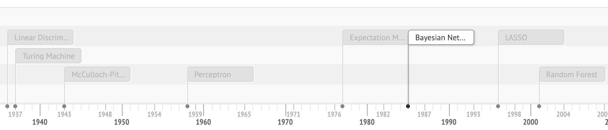

# Machine Learning Timeline

Important milestones on the **[journey](https://leandromineti.github.io/ml-timeline)** towards learning machines. It includes advancements in optimization, statistics, artificial intelligence and machine learning. It is important to note that history is never clear cut. An effort was made to select original contributions that are usually acclaimed by the community as pioneering work.

## Contributing

If you spot a mistake or omission, please feel free to create a new issue. 

## References

- A “Brief” History of Neural Nets and Deep Learning. (n.d.). Retrieved February 4, 2019, from /writing/ai/a-brief-history-of-neural-nets-and-deep-learning/
- A Review of the Neural History of Natural Language Processing. (2018, October 1). Retrieved February 2, 2019, from http://blog.aylien.com/a-review-of-the-recent-history-of-natural-language-processing/
- Bottou, L., Curtis, F. E., & Nocedal, J. (2018). Optimization methods for large-scale machine learning. SIAM Review, 60(2), 223-311.
- Bixby, R. E. (2012). A brief history of linear and mixed-integer programming computation. Documenta Mathematica, 107-121.
- Casella, G., & Robert, C. P. (2011). A Short History of Markov Chain Monte Carlo: Subjective Recollections from Incomplete Data (No. 123456789/3549). Paris Dauphine University.
- Deep Learning 101 - Part 1: History and Background. (n.d.). Retrieved February 4, 2019, from https://beamandrew.github.io/deeplearning/2017/02/23/deep_learning_101_part1.html
- Gass, S. I., & Assad, A. A. (2005). An annotated timeline of operations research: An informal history (Vol. 75). Springer Science & Business Media.
- Haugeland, J. (1989). Artificial intelligence: The very idea. MIT press.
- Lemaréchal, C. (2012). Cauchy and the gradient method. Doc Math Extra, 251, 254.
- Liu, J., Kong, X., Xia, F., Bai, X., Wang, L., Qing, Q., & Lee, I. (2018). Artificial Intelligence in the 21st Century. IEEE Access, 6, 34403–34421. https://doi.org/10.1109/ACCESS.2018.2819688
- Salsburg, D. (2001). The lady tasting tea. Henry Holt and Company, LLC, New York, NY.
- Stigler, S. M. (1986). The history of statistics: The measurement of uncertainty before 1900. Harvard University Press.
- Zsohar, P. (2010). Short introduction to the generalized method of moments. Hungarian Statistical Review, 16, 150-170.
